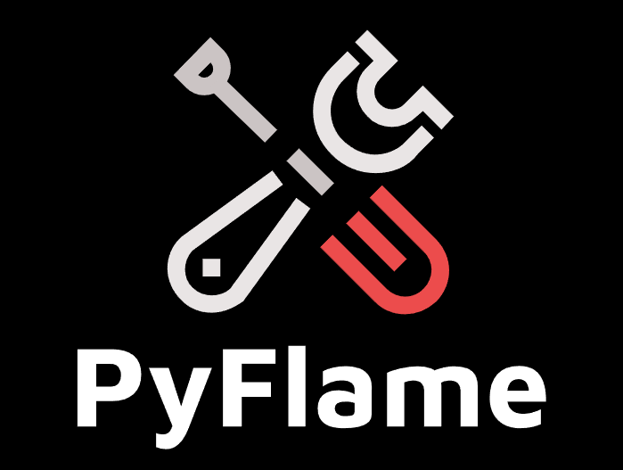

# PyFlame

  </a>

 <strong>PyFlame,a configuration-driven trainer for generative models.code coming......</strong>

## Comments

- This project is a Leisure time hobby，If you are interested in the project ,you can make a issue.
- Our codebase for the PyFlame builds heavily on [DL-Art-School codebase](https://github.com/neonbjb/DL-Art-School),Thanks for open-sourcing! 
- The difference of DL-Art-School and PyFlame is that PyFlame optimizes the entire DL-Art-School code structure and easy to use.
  
## Roadmap
goal： everone can train deep neural networks
